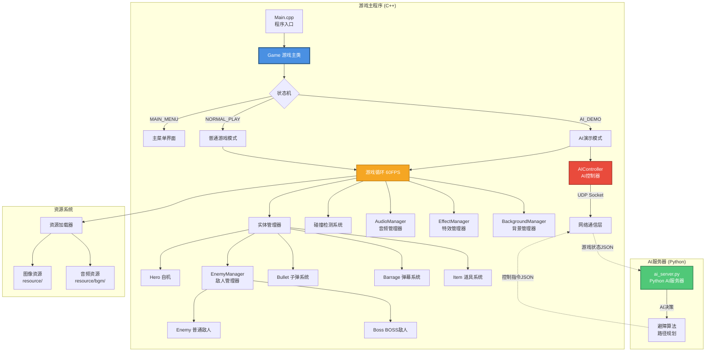
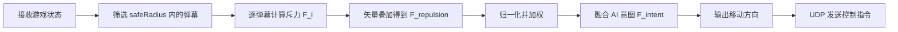

# 东方Project OOP - 弹幕射击游戏与AI自动控制避障算法

[](https://github.com/yourusername/TouhouOOP)
[](LICENSE)
[](https://www.microsoft.com/windows)
[](https://isocpp.org/)

一款基于 C++ 和 EasyX 图形库开发的东方Project风格弹幕射击游戏（STG），支持普通游戏模式和 AI 演示模式。

->[演示视频](https://www.bilibili.com/video/BV19pZ9BJEii/?share_source=copy_web&vd_source=74410e72b595e63dc542c701a4166982)

---

## ✨ 核心功能

- **🎮 双游戏模式**
  - 普通模式：玩家手动操控自机进行游戏
  - AI 演示模式：基于 Python + UDP 通信的智能 AI 自动游玩

- **👾 波次敌人系统**
  - 支持普通敌人、精英敌人（Elf）和 Boss 三种敌人类型
  - 基于时间轴的波次生成系统（Wave System）
  - Boss 多阶段战斗机制，每个阶段拥有独立的血量、移动逻辑和弹幕模式

- **💥 复杂弹幕系统**
  - 10+ 种弹幕类型：直线弹、风车弹、烟花弹、环形弹、瞄准弹、五芒星弹等
  - 多种子弹样式和颜色配置

- **🎯 碰撞检测系统**
  - 圆形碰撞检测算法
  - 自机判定点（JudgePoint）机制
  - 无敌时间（Invincibility）保护

- **🎵 音频系统**
  - BGM 背景音乐自动切换（普通关卡 / Boss 战）
  - 音效系统（射击、爆炸、符卡展开等）

- **🤖 AI 控制系统**
  - Python 服务器通过 UDP 接收游戏状态
  - 混合避障算法：结合 AI 意图和局部斥力场
  - 实时游戏状态同步（自机、敌人、弹幕位置）

- **🎨 视觉效果**
  - 爆炸特效、符卡立绘、背景切换
  - 60 FPS 稳定帧率控制
  - UI 显示（残机、符卡数、分数、Boss 血条）

---

##  游戏操作

| 按键 | 功能 |
| :--- | :--- |
| **↑ ↓ ← →** | 控制自机移动 |
| **Z** | 射击 |
| **X** | 释放符卡 (Bomb) |
| **Shift** | 低速模式，显示判定点 |

---

## 🏗️ 架构概览

### 系统架构说明

本项目采用经典的游戏循环架构，结合状态机模式管理游戏状态。核心模块包括：

1. **游戏主循环（Game Loop）**：60 FPS 固定帧率，使用高精度计时器和自旋锁保证稳定性
2. **状态机（State Machine）**：管理主菜单、普通模式、AI 演示模式三种状态
3. **实体管理系统**：统一管理自机、敌人、子弹、弹幕、道具等游戏对象
4. **碰撞检测系统**：基于圆形碰撞的高效检测算法
5. **AI 通信模块**：C++ 游戏端与 Python AI 服务器通过 UDP 实时通信

### 系统架构图



### 数据流说明

**普通模式数据流：**
```
用户输入 → Hero 移动/射击 → 碰撞检测 → 敌人/弹幕更新 → 渲染输出
```

**AI 模式数据流：**
```
游戏状态 → UDP发送 → Python AI → 决策计算 → UDP接收 → Hero 自动控制 → 游戏更新
```

---

## 🚀 快速开始

### 环境要求

在开始之前，请确保您的开发环境满足以下要求：

| 依赖项 | 版本要求 | 说明 |
|--------|---------|------|
| **操作系统** | Windows 10/11 | 必须，EasyX 仅支持 Windows |
| **编译器** | Visual Studio 2019+ | 推荐使用 MSVC 编译器 |
| **C++ 标准** | C++17 或更高 | 使用了 `std::function`、lambda 等特性 |
| **EasyX 图形库** | 最新版 | [下载地址](https://easyx.cn/) |
| **Python** | 3.8+ | 仅 AI 模式需要 |
| **Python 依赖** | numpy, socket | AI 模式依赖 |

### 安装步骤

#### 1. 克隆项目

```bash
git clone https://github.com/yourusername/TouhouOOP.git
cd TouhouOOP
```

#### 2. 安装 EasyX 图形库

1. 访问 [EasyX 官网](https://easyx.cn/) 下载最新版安装包
2. 运行安装程序，选择您的 Visual Studio 版本
3. 安装完成后重启 Visual Studio

#### 3. 配置项目

1. 使用 Visual Studio 打开 `TouhouOOP.sln` 解决方案文件
2. 右键点击项目 → 属性 → C/C++ → 语言 → 符合模式：**否**
3. 确保项目配置为 **x86** 或 **x64**（与 EasyX 安装版本一致）
4. 检查 `Library.h` 中的路径常量是否正确

#### 4. 编译项目

```bash
# 在 Visual Studio 中按 Ctrl+Shift+B 编译
# 或使用命令行（需配置 MSBuild 环境变量）
msbuild TouhouOOP.sln /p:Configuration=Release /p:Platform=x86
```

#### 5. 运行游戏

**普通模式：**
```bash
# 直接运行编译生成的 exe 文件
./x64/Release/TouhouOOP.exe
```

**AI 演示模式：**
```bash
# 游戏会自动启动 Python 服务器，无需手动运行
# 如需手动启动 AI 服务器（调试用）：
python ai_server.py
```

---

## ⚙️ 配置说明

### 游戏配置

游戏的核心配置位于 `Library.h` 文件中：

```cpp
// 游戏区域尺寸
const int WIDTH = 750;          // 游戏区域宽度
const int HEIGHT = 900;         // 游戏区域高度
const int screenWidth = 1280;   // 窗口总宽度
const int screenHeight = 960;   // 窗口总高度

// 边界定义
const int LeftEdge = 32;        // 左边界
const int TopEdge = 30;         // 上边界
const int Right = LeftEdge + WIDTH;
const int Bottom = TopEdge + HEIGHT;

// 中心点坐标
const int CentralX = 375;       // 水平中心
const int CentralY = 250;       // 垂直中心
```

### 环境变量配置（可选）

项目根目录下的 `.env` 文件用于配置可选参数：

```bash
# AI 服务器配置
AI_SERVER_PORT=9090           # UDP 监听端口
AI_UPDATE_INTERVAL=10         # AI 状态更新间隔（帧数）

# 调试选项
DEBUG_MODE=0                  # 是否开启调试模式（显示碰撞圈）
SHOW_FPS=1                    # 是否显示 FPS
```

**重要提示：**
- `.env` 文件不会被上传到 Git 仓库
- 请手动创建 `.env` 文件并添加您自己的 API 密钥
- 需要 ‘python-dotenv’库
- 示例配置：
  ```bash
  # 在项目根目录创建 .env 文件
  API_KEY=your_api_key_here
  API_ENDPOINT=https://your-api-endpoint.com
  ```

### AI 自动避障：斥力场算法详解

#### 算法原理

本项目的 AI 自动避障基于经典的 **人工势场法（Artificial Potential Field, APF）** 中的斥力场（Repulsive Field）思想，并结合 AI 决策意图形成 **混合避障算法**。其核心理念是：

> 将每一颗敌方弹幕视为一个"带电粒子"，对自机产生排斥力；自机所受合力方向即为最终的移动方向。

#### 数学模型

对于自机位置 `P_hero = (x_h, y_h)` 与第 `i` 颗弹幕位置 `P_i = (x_i, y_i)`，定义：

**1. 距离向量：**
```
d_i = P_hero - P_i
|d_i| = sqrt((x_h - x_i)² + (y_h - y_i)²)
```

**2. 单颗弹幕的斥力（仅在安全半径内生效）：**
```
        ┌  k * (1/|d_i| - 1/safeRadius) * (d_i / |d_i|²),   |d_i| ≤ safeRadius
F_i =  ┤
        └  0,                                                |d_i| > safeRadius
```

其中：
- `k`：斥力系数（强度），距离越近斥力呈 **平方反比** 急剧增大
- `safeRadius`：安全半径，超出此范围的弹幕被忽略，提升计算效率
- 方向：从弹幕指向自机（即"推开"自机）

**3. 局部斥力场合力（所有弹幕的矢量叠加）：**
```
F_repulsion = Σ F_i  (i = 1, 2, ..., N)
```

**4. AI 意图向量（来自策略层，例如收集道具、追击 Boss、移动到安全区）：**
```
F_intent = (intent_x, intent_y)   // 单位化方向向量
```

**5. 最终移动方向（加权融合）：**
```
F_final = repulsionWeight * normalize(F_repulsion) + intentWeight * F_intent
```

将 `F_final` 离散化为上下左右四个方向键的输入，即可驱动自机自动躲避。

#### 算法流程



#### 算法优势与局限

**✅ 优势：**
- **计算高效**：O(N) 复杂度，适合实时弹幕游戏
- **平滑响应**：斥力随距离连续变化，避障动作自然流畅
- **可解释性强**：参数物理意义明确，便于调试

**⚠️ 局限：**
- **局部最小值问题**：当弹幕从多个方向同时夹击时，合力可能为零导致"卡死"
- **解决方案**：引入随机扰动 / 历史方向惯性 / 全局路径规划（项目中通过 `intentWeight` 注入策略意图来缓解）

#### 参数调整

在 `Game.cpp` 的 `InitAIDemo()` 方法中可调整 AI 行为：

```cpp
// 设置避障参数
aiController->SetAvoidanceParams(
    80.0f,   // safeRadius: 危险半径（像素），弹幕进入此范围触发避障
    0.8f,    // repulsionWeight: 斥力权重（0.0-1.0），越大越倾向于躲避
    0.2f     // intentWeight: 意图权重（0.0-1.0），越大越倾向于进攻
);
```

**参数说明：**
- `safeRadius`：弹幕距离自机多少像素时开始计算斥力。值越大反应越早，但可能过度保守
- `repulsionWeight`：避障优先级，建议 0.7-0.9（过低会撞弹，过高会过于保守）
- `intentWeight`：进攻优先级，建议 0.1-0.3（与 repulsionWeight 之和应接近 1.0）

### 关卡配置

关卡波次配置位于 `Game.cpp` 的 `InitNormalLevels()` 方法中：

```cpp
// 第一波敌人配置示例
waveData w1;
w1.waveDelay = 2000;           // 波次开始前等待时间（毫秒）

SpawnEvent e1;
e1.startTime = 500;            // 波次开始后多久生成（毫秒）
e1.count = 10;                 // 生成敌人数量
e1.interval = 400;             // 每个敌人生成间隔（毫秒）
e1.hp = 1;                     // 敌人血量
e1.type = eType::normal;       // 敌人类型
e1.startX = CentralX;          // 起始 X 坐标
e1.startY = TopEdge;           // 起始 Y 坐标
e1.moveLogic = Moves::SineWave(CentralX, 50, 2.0f, 3.0f); // 移动逻辑
```

---

## 🐛 故障排除 / 常见问题

### 1. 编译错误：`fatal error C1083: 无法打开包括文件: "graphics.h"`

**原因：** EasyX 图形库未正确安装或 Visual Studio 未识别到头文件路径。

**解决方案：**
```bash
# 步骤 1：重新安装 EasyX
# 从 https://easyx.cn/ 下载最新版安装包
# 运行安装程序，确保选择了正确的 Visual Studio 版本

# 步骤 2：手动添加包含目录（如果自动安装失败）
# 在 Visual Studio 中：
# 项目 → 属性 → C/C++ → 常规 → 附加包含目录
# 添加：C:\Program Files (x86)\EasyX\include

# 步骤 3：添加库目录
# 项目 → 属性 → 链接器 → 常规 → 附加库目录
# 添加：C:\Program Files (x86)\EasyX\lib
```

### 2. 运行时错误：`无法启动程序，找不到 EasyX.dll`

**原因：** 动态链接库未正确配置或缺失。

**解决方案：**
```bash
# 方案 1：将 EasyX.dll 复制到 exe 同目录
copy "C:\Program Files (x86)\EasyX\lib\EasyX.dll" ".\x64\Release\"

# 方案 2：添加系统环境变量
# 将 C:\Program Files (x86)\EasyX\lib 添加到系统 PATH

# 方案 3：使用静态链接（推荐）
# 项目属性 → C/C++ → 代码生成 → 运行库 → 多线程 (/MT)
```

### 3. AI 模式启动失败：`[Game] 启动 Python 服务器失败！`

**原因：** Python 未安装或不在系统 PATH 中，或 `ai_server.py` 文件缺失。

**解决方案：**
```bash
# 步骤 1：检查 Python 是否安装
python --version
# 应输出：Python 3.8.x 或更高版本

# 步骤 2：检查 ai_server.py 是否存在
ls ai_server.py
# 应显示文件存在

# 步骤 3：手动测试 Python 服务器
python ai_server.py
# 应输出：[AI Server] 正在监听 0.0.0.0:9090...

# 步骤 4：如果 Python 不在 PATH 中，修改 Game.cpp 中的启动命令
# 将 "python ai_server.py" 改为完整路径：
# "C:\\Python38\\python.exe ai_server.py"
```

## 📝 开发说明

### 添加新弹幕类型

1. 在 `Barrage.h` 的 `bType` 枚举中添加新类型
2. 在 `Barrage.cpp` 中实现对应的弹幕生成函数
3. 在 `Game.cpp` 的 `Barrages()` 方法中添加 switch case

### 添加新敌人类型

1. 在 `Enemy.h` 的 `eType` 枚举中添加新类型
2. 在 `Enemy.cpp` 中配置对应的宽高和图像资源
3. 在 `Game.cpp` 的关卡配置中使用新类型

### 调试技巧

- 按住 **TAB** 键显示碰撞判定圈（红色中心点 + 绿色判定圈）
- 修改 `Library.h` 中的常量可快速调整游戏区域大小
- 使用 Visual Studio 的性能分析器定位性能瓶颈

---

## 📄 许可证

本项目采用 MIT 许可证。详见 [LICENSE](LICENSE) 文件。

---

## 🙏 致谢

- [EasyX 图形库](https://easyx.cn/) - 提供简洁的 Windows 图形接口
- [东方Project](https://www16.big.or.jp/~zun/) - 原作灵感来源
- [nlohmann/json](https://github.com/nlohmann/json) - C++ JSON 解析库

---

**注意：** 本项目仅供学习交流使用，请勿用于商业用途。游戏素材版权归原作者所有。
